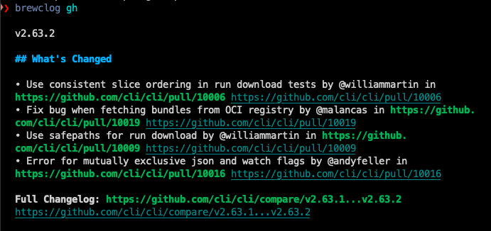

# brewclog
## Display the last Changelog of a Brew Formula

## 💾 Installation

fisher install ltaupiac/brewclog

Demo :

### Usage
Usage: brewclog [options] <formula>

Displays the changeclog of the latest GitHub release of a Homebrew formula.

Options:

-t, --trace : Verbose mode

-d, --debug : Show debugging information

-h, --help : Show this help message

-v, --version : Show version

### Abbr

An abbr is defined : **,bl**

### Dependencies

- jq    : Command-line JSON processor
- glow  : Render Markdown on the CLI, with pizzazz!
- trurl : Url manipulation

### Limitations
Works only for GitHub

## ©️ License

[MIT](LICENSE)
